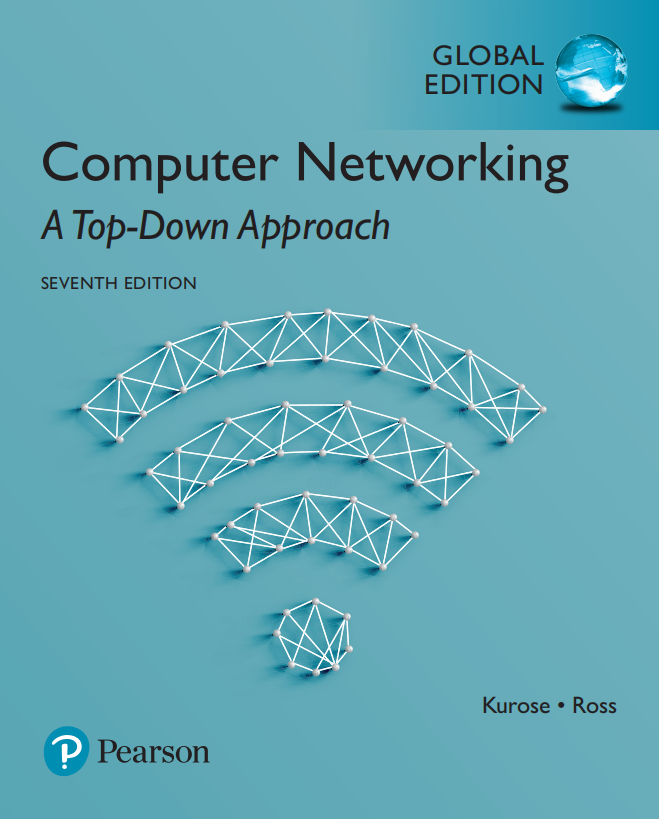

# Computer Networking: A Top Down Approach

:star:Personal Study Notes and Exercise Records from 《Computer Networking: A Top Down Approach (8th edtion)》 :star:

 [official website](https://gaia.cs.umass.edu/kurose_ross/online_lectures.htm)

### Learning Materials

---

[Notes](./notes) 

[Labs](./labs) 

[Assignments](./assignments) 

Self-Assessment Quiz : small quiz for each chapter

- [Self-Assessment Multiple Choice Quiz](https://media.pearsoncmg.com/ph/esm/ecs_kurose_compnetwork_8/cw/content/self-assessment-mc/self-assessment-mc.php) 

- [Self-Assessment True/False Quiz](https://media.pearsoncmg.com/ph/esm/ecs_kurose_compnetwork_8/cw/content/self-assessment-tf/self-assessment-tf.php)

[Interactive Animation](https://media.pearsoncmg.com/ph/esm/ecs_kurose_compnetwork_8/cw/#interactiveanimations) :  vivid animation for some obscure concepts 

[Other materials](https://media.pearsoncmg.com/ph/esm/ecs_kurose_compnetwork_8/cw/)

### Other Useful Links
[PKUFlyingPig](https://github.com/PKUFlyingPig/Computer-Network-A-Top-Down-Approach)